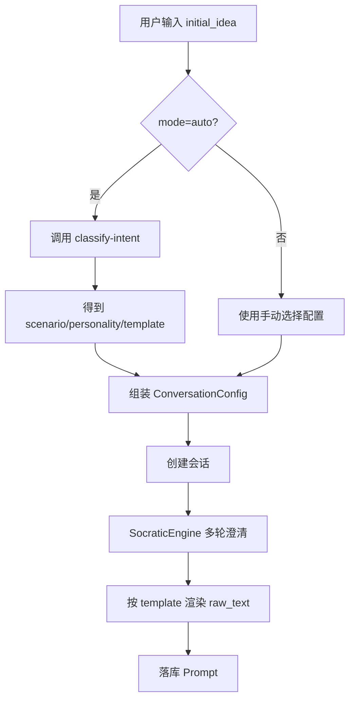

# PromptGo Prompt 架构复现技术文档

## 1. 目标

本文档基于当前代码实现，给出可复现的技术架构，重点回答：

- Prompt 如何从会话中生成
- Standard/XML/LangGPT/CO-STAR 如何实现
- Auto 自动选择如何搭建
- 当前哪些模块已实现但未接主链路

## 2. 系统总览

## 2.1 前后端

- 前端：React + TypeScript + Vite
- 后端：FastAPI + SQLAlchemy + SQLite
- 可选增强：ChromaDB + Embedding API（RAG）

## 2.2 主链路组件

1. `conversations router`：会话 API
2. `SocraticEngine`：多轮澄清 + 框架渲染核心
3. `llm_service`：多供应商 LLM 适配
4. `CRUD + models`：持久化会话/消息/Prompt

## 2.3 配置链路组件（半独立）

1. `prompt_options.json`：场景、人设、模板配置
2. `IntentClassifier`：auto 分类器
3. `PromptAssembler`：三层模块拼装器（当前未接主链路）

## 3. 主流程（As-Is）

## 3.1 新建会话

前端调用：

- `POST /api/conversations`
- body: `initial_idea + config`

后端流程：

1. 创建会话记录（保存 provider/model/framework）
2. 初始化 `SocraticEngine(llm, max_turns, prompt_framework)`
3. 调用 `start_conversation(initial_idea)`
4. 返回第一轮 `question` 或直接 `prompt`

## 3.2 继续会话

前端调用：

- `POST /api/conversations/{id}/messages`

后端流程：

1. 写入用户消息
2. 更新回合数
3. 调用 `SocraticEngine.continue_conversation(...)`
4. 若返回 question：写 assistant question
5. 若返回 prompt：写 assistant raw_text + 落库 Prompt + 标记 completed

## 3.3 二次优化

- `POST /api/conversations/{id}/refine`
- 构造“优化专家”指令，让 LLM 按 JSON 返回新的 prompt/raw_text/tags
- 成功后覆盖 `prompts` 表记录

## 4. Prompt 框架实现细节

## 4.1 实现位置

在 `backend/app/services/socratic_engine.py`：

- `PROMPT_FRAMEWORK_TEMPLATES`
- `_format_prompt_with_framework`

## 4.2 4 种模板映射

1. `standard`
   - 角色/任务/约束/输出格式/质量标准/初始化
2. `langgpt`
   - Role/Profile/Skills/Rules/Workflow/Output/Initialization
3. `costar`
   - Context/Objective/Style/Tone/Audience/Response
4. `structured`
   - XML 标签化结构（`<role>`, `<task>`, `<constraints>` 等）

## 4.3 渲染机制

当 LLM 返回：

```json
{
  "type":"prompt",
  "prompt": {...},
  "raw_text":"..."
}
```

引擎会忽略原始 `raw_text`，按 `prompt_framework` 调用模板重新生成最终 `raw_text`。

## 5. Auto 自动选择实现细节

## 5.1 配置源

`backend/app/config/prompt_options.json` 包含：

- scenarios（含 keywords / recommended_personality / recommended_template）
- personalities
- templates
- compatibility_matrix

## 5.2 分类器

`backend/app/services/intent_classifier.py`

机制：

1. 加载场景关键词表
2. 对输入做关键词命中计分
3. 取最高分场景
4. 按命中比计算 confidence
5. 低置信度回退 `general`
6. 输出 `scenario + recommended_personality + recommended_template`

## 5.3 后端接口

`backend/app/routers/config.py`：

- `GET /api/config/prompt-options`
- `POST /api/config/classify-intent`
- `POST /api/config/preview-skeleton`
- `GET /api/config/scenarios|personalities|templates`

## 5.4 前端现状

前端已有 Prompt 设置弹窗，并能加载上述配置接口。

但会话开始时：

- 实际只传 `template -> promptFramework`
- `scenario/personality/verbosity` 未传到会话 API
- `classify-intent` 未在 `onStart` 前调用

结论：Auto 在“配置层和 UI 层”已存在，在“生成主链路”未打通。

## 6. 数据模型与接口契约

## 6.1 数据表

`conversations`：

- `initial_idea`
- `status`
- `current_turn/max_turns`
- `llm_provider/base_url/api_key/llm_model`
- `prompt_framework`

`messages`：

- `conversation_id`
- `role`
- `content`

`prompts`：

- `conversation_id`
- `role_definition/task_description`
- `constraints/output_format/examples`
- `raw_text/tags`

## 6.2 会话配置（当前）

`LLMConfig` 已支持：

- `llm_provider`
- `base_url`
- `api_key`
- `model`
- `max_turns`
- `prompt_framework`

未支持（建议扩展）：

- `scenario`
- `personality`
- `verbosity`
- `mode(auto/manual)`

## 7. 未接入但可复用模块

## 7.1 PromptAssembler（建议用于 To-Be）

三层拼装：

1. Layer A：场景契约
2. Layer B：人设风格
3. Layer C：输出模板

附加能力：

- skill 注入
- memory 注入
- citation rules 注入
- verbosity 指令注入

当前主要被 `preview-skeleton` 用于预览，未用于真实生成。

## 7.2 Skill/Memory/Citation 模块

- `skill_loader.py`：从 `config/skills/*.md` 解析技能规则
- `memory_manager.py`：用户偏好与会话记忆注入
- `citation_rules.py`：引用规范/输出规范注入

这些模块具备可用实现，适合在新项目直接接入 Prompt 组装层。

## 8. 新项目复现方案（建议 To-Be）

## 8.1 目标链路



## 8.2 后端改造步骤

1. 扩展 `schemas.conversation.LLMConfig`
   - 增加 `mode/scenario/personality/verbosity`
2. 扩展 `models.conversation`
   - 增加上述字段用于审计与复用
3. 改造 `POST /api/conversations`
   - 若 mode=auto，服务端执行 `classify-intent`
   - 统一得到最终 `scenario/personality/template/verbosity`
4. 把最终配置传入 `SocraticEngine` 或 `PromptAssembler`
5. 在生成完成后把最终配置一并回传前端

## 8.3 前端改造步骤

1. 在 `onStart` 组装完整 Prompt 设置
2. mode=auto 时可选择前端先调 classify 或后端内调
3. 会话响应展示“本次最终配置”（scenario/personality/template）
4. 历史会话加载时展示当时配置

## 8.4 推荐实现策略

- 短期：继续以 `SocraticEngine` 为主，补齐 auto 配置入参
- 中期：将 `PromptAssembler` 接入 `SocraticEngine`，统一拼装规则
- 长期：skill/memory/citation/rag 做可开关策略编排

## 9. API 设计建议（复现版）

## 9.1 创建会话请求

```json
{
  "initial_idea": "帮我写一个客服回复 prompt",
  "config": {
    "mode": "auto",
    "scenario": "auto",
    "personality": null,
    "template": "standard",
    "verbosity": 5,
    "llm_provider": "anthropic",
    "model": "claude-sonnet-4-5-20250929",
    "prompt_framework": "standard"
  }
}
```

## 9.2 创建会话响应（建议）

```json
{
  "conversation_id": "uuid",
  "status": "in_progress",
  "current_turn": 1,
  "max_turns": 5,
  "resolved_config": {
    "mode": "auto",
    "scenario": "customer_service",
    "personality": "professional",
    "template": "standard",
    "confidence": 0.82
  },
  "response": {
    "type": "question",
    "question": "..."
  }
}
```

## 10. 测试与验收建议

## 10.1 单元测试

1. IntentClassifier 命中与回退测试
2. 4 模板渲染快照测试
3. 会话轮次终止条件测试
4. refine JSON 解析兜底测试

## 10.2 集成测试

1. auto 模式端到端：输入 -> 分类 -> 问答 -> prompt
2. manual 覆盖 auto：手动 template 优先
3. 历史恢复一致性：prompt_framework/配置字段一致

## 10.3 回归测试数据集

- 代码类 20 条
- 客服类 20 条
- 创作类 20 条
- 分析类 20 条
- 教学类 20 条

并记录分类准确率、完成回合数、用户二次修改率。

## 11. 风险与规避

1. 关键词分类偏差：
   - 规避：增加负例关键词、置信度阈值、fallback
2. UI 配置与后端不一致：
   - 规避：后端回传 `resolved_config`，前端只展示后端最终值
3. 提示词模板漂移：
   - 规避：模板版本号 + 快照测试
4. 注入风险：
   - 规避：检索内容统一标记不可信，不得覆盖系统规则

## 12. 最小复现清单

1. 1 个会话接口 + 1 个消息接口 + 1 个 refine 接口
2. 1 个 intent classify 接口
3. 1 份 `prompt_options.json`
4. 4 个框架模板
5. 3 张表（conversations/messages/prompts）
6. 前端 3 个面板（聊天/设置/历史）

